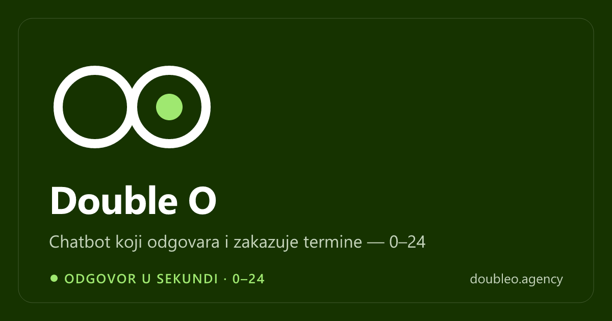

# Double O Website

Bilingual (Serbian / English) website, blog and AI chat for **Double O**, an AI automation agency that builds chatbots, outreach, content and voice systems for businesses. I co-founded the agency and built this site.

**Live demo:** https://doubleo-website-lazar22gosic-2579s-projects.vercel.app
**Production domain:** https://doubleo.agency




## Overview

The agency needed more than a brochure site: a place to explain six productized AI solutions, a blog that fills itself, and a live demo of the agency's own work. The result is a Next.js App Router site with locale-prefixed routes. Blog posts are written and translated by an n8n workflow, delivered to a protected API, and reviewed in a small admin panel. An AI chat agent, also running on n8n, answers visitors from the hero section and from a floating widget.

## Key features

- **Bilingual routing:** `/sr` (default) and `/en` via next-intl, with every string in `messages/{sr,en}.json` and full `hreflang` sets per page.
- **Solutions catalogue:** six solution pages (chatbot, content dashboard, lead reactivation, speed-to-lead, AI UGC creatives, AI receptionist) generated from one typed list in `lib/solutions.ts` that also drives the nav, the overview page and the sitemap.
- **Automated blog pipeline:** n8n `POST`s bilingual Markdown posts to `/api/posts`. Each post is saved as a draft, or published straight away if auto-publish is on.
- **Admin panel** (`/admin`): Supabase Auth login, draft preview, publish / unpublish / delete, and the auto-publish toggle.
- **Blog reading experience:** server-built table of contents, reading time, GFM Markdown and on-demand revalidation when a post is published.
- **AI chat, in two forms:** an inline hero chat card and an embeddable vanilla-JS widget (`public/assets/widget.js`). The widget is configured entirely by `data-*` attributes, so it can be reused on client sites.
- **Privacy-first analytics:** GA4 + GTM with Google Consent Mode v2 and a custom, non-blocking consent banner, plus Vercel Analytics.
- **Contact page** with a form relay and an optional Cal.com booking link.

## Tech stack

| Area | Tools |
| --- | --- |
| Frontend | Next.js 15 (App Router, SSG/SSR), React 18, TypeScript, next-intl |
| Styling | Hand-written CSS design system (`app/styles/*`), Tailwind CSS v4 utilities only for vendored components |
| Motion | Motion (Framer Motion), Lenis smooth scroll |
| Backend / data | Supabase (Postgres, Row Level Security, Auth), Next.js Route Handlers and Server Actions, Zod |
| Automation | n8n (blog generation, chat agent), Cloudflare R2 for post images |
| Tooling | ESLint 9 (flat config), sharp + resvg asset-generation scripts |
| Deployment | Vercel |

## Technical highlights

- **Locked-down data layer.** RLS lets the public read only published posts. Writes have no RLS policies at all: they go through server code using the service-role key, after a bearer-token check (ingestion API) or a Supabase session check (admin Server Actions). Middleware refreshes the admin session and leaves `/admin` outside locale routing.
- **Validated ingestion API.** `/api/posts` validates the payload with Zod (slug format, required SR/EN fields, URL checks), maps duplicate slugs to `409`, and revalidates only the affected blog and sitemap paths.
- **Same-origin chat proxy.** The n8n webhook only allows the production origin, so `/api/chat` forwards requests server-side with Zod input limits and a 45-second abort timeout. Chat then works on localhost and preview deploys too. The hero chat and the widget keep separate session IDs so their conversations never share one n8n memory buffer.
- **Scroll-driven motion, built by hand.** `ScrollWordReveal` (words un-blur as you scroll through a pinned block) and `StickyStack` (a deck of cards that compounds scale and dims with an opaque scrim) measure their own scroll progress instead of using `useScroll` offsets, which drifted out of sync while the block was pinned. `InteractiveCard` adds a spring-based 3D tilt and a glow that follows the pointer.
- **Reduced motion respected everywhere.** A global `MotionConfig reducedMotion="user"` covers Motion animations. Lenis, the hero video and the CSS marquee all switch off under `prefers-reduced-motion`.
- **CSS architecture.** `app/globals.css` only imports layered stylesheets (tokens, base, motion, ui, layout, sections, chat, pages, blog, admin). Tailwind is loaded without Preflight in its own cascade layers, so vendored components get utilities and site styles can't be overridden by accident. The full token set is documented in [`DESIGN-SYSTEM.md`](DESIGN-SYSTEM.md).
- **Generated assets.** Node scripts build favicons, the OG card (SVG rendered with resvg) and optimized team photos from master files, so no derived image is edited by hand.

## Getting started

**Prerequisites:** Node.js 18.18+ (20 LTS recommended), npm, and a Supabase project.

```bash
npm install
cp .env.local.example .env.local   # then fill in real values
npm run dev                        # http://localhost:3000
```

Other scripts:

```bash
npm run build      # production build
npm run start      # serve the production build
npm run lint       # ESLint (next/core-web-vitals)
npx tsc --noEmit   # type check
npm run icons      # regenerate favicons/app icons from public/logos/
npm run og         # regenerate public/og.png
npm run team       # regenerate team photos from assets/team-photos/
```

### Environment variables

Defaults for most of these live in `lib/config.ts`. An env var overrides its default.

| Variable | Purpose |
| --- | --- |
| `NEXT_PUBLIC_SUPABASE_URL`, `NEXT_PUBLIC_SUPABASE_ANON_KEY` | Supabase project and public anon key |
| `SUPABASE_SERVICE_ROLE_KEY` | Server-only key for the ingestion API and admin actions |
| `POSTS_API_BEARER_TOKEN` | Secret n8n sends as `Authorization: Bearer <token>` to `POST /api/posts` |
| `NEXT_PUBLIC_SITE_URL` | Base URL for canonical links, OG tags and the sitemap |
| `NEXT_PUBLIC_CALCOM_URL`, `NEXT_PUBLIC_FORM_ENDPOINT` | Booking link and contact-form relay |
| `CHAT_WEBHOOK_URL` | n8n chat agent webhook (server-only), reached through `/api/chat` |
| `NEXT_PUBLIC_GA_ID`, `NEXT_PUBLIC_GTM_ID` | GA4 and Tag Manager. An empty value disables the tag (use this on previews) |
| `NEXT_PUBLIC_INSTAGRAM_URL`, `NEXT_PUBLIC_LINKEDIN_URL`, `NEXT_PUBLIC_X_URL`, `NEXT_PUBLIC_FACEBOOK_URL` | Footer social links, each shown only when set |

### Database setup (one time)

1. Run `supabase/migrations/0001_init.sql` in the Supabase SQL editor. It creates the `posts` and `settings` tables with RLS.
2. Create an admin user in the Supabase dashboard (Authentication → Users → Add user). There is no self-signup for `/admin`.

### Blog content pipeline

1. n8n generates a bilingual post in Markdown and uploads any images to Cloudflare R2.
2. n8n sends it to `POST /api/posts` with the bearer token. See `app/api/posts/route.ts` for the exact schema.
3. The post lands as a **draft** unless auto-publish is enabled in `/admin`.
4. Drafts are reviewed and published from `/admin`.

## Project structure

```
app/
  [locale]/            Home, /solutions, /solutions/[slug], /blog, /blog/[slug], /contact, /privacy-policy
  admin/               Login and the protected dashboard (Server Actions in actions.ts)
  api/posts/           n8n blog ingestion endpoint
  api/chat/            Server-side proxy to the n8n chat agent
  styles/              Layered CSS design system (tokens → base → ... → admin)
components/
  sections/            Home page sections (hero, bento, solutions, about, team, FAQ, ...)
  motion/              Appear, SplitWords, ScrollWordReveal, StickyStack, InteractiveCard, Lenis
  chat/                Hero chat card and useChat hook
  blog/, layout/       Table of contents, CTA, nav, footer, language switcher
  lightswind/          Vendored third-party components
i18n/                  next-intl routing and request config
lib/                   Config, Supabase clients, posts/settings data access, SEO, TOC, consent
messages/              sr.json / en.json UI copy
public/assets/         Embeddable chat widget
scripts/               Icon, OG image and team photo generators
supabase/migrations/   Schema and RLS policies
```

## Author

Lazar Gošić, co-founder of Double O — GitHub [@lakygosh](https://github.com/lakygosh)
